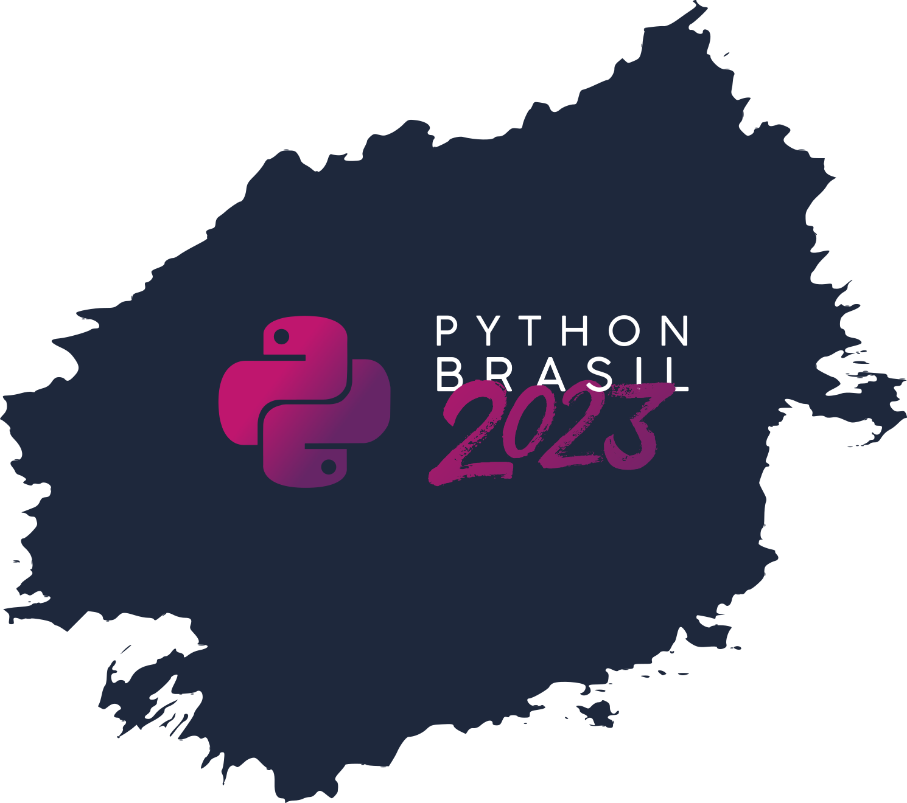

[](https://www.gnu.org/licenses/gpl-3.0)

# Repositorio do site Python Brasil 2023

[Site Python Brasil](https://2023.pythonbrasil.org.br)

O Projeto utiliza [Pelican](https://docs.getpelican.com/en/latest/) como framework!

A maioria dos dados sensiveis que podem ser alterados com facilidade editando o arquivo `pelicanconf` ou `publishconf`

Dentro da pasta theme tem o tema que esta sendo usado na compilação, por ser estatico muita coisa esta informada dentro dele mesmo mas é possivel ir externalizando utilizando alguns recursos do pelican vide [doc](https://docs.getpelican.com/en/latest/) .

Por favor use os arquivos **html** dentro da pasta **theme** para editar o conteúdo e a estrutura do site, leia com atenção por que o thema tem variáveis específicas e também pode usar alguns recursos do jinja para o adicionar o conteúdo a pagina.

O arquivo `CNAME` é automaticamente copiado para dentro do output, levando os dados necessarios junto com o tema e os estilos.

Para estilizar use o arquivo `styles.css` em `\theme\static\css\`

Toda a pasta static ira para o output na compilação sempre que precisar limpar *html,css,js,...* apague a pasta **output** e rode novamente o comando de inicializar ou utilize o comando

```
invoke clean
```

lembrando que todos os comandos invoke estão no arquivo `tasks.py`


# Ambiente
```shell
gh repo clone pythonbrasil/pybr2023-site;
cd pybr2023-site
python3 -m venv .venv
source .venv/bin/activate
pip install -r requirements.txt
```

# Rodar/Iniciar

```shell
source .venv/bin/activate
invoke livereload
```

vai rodar em http://127.0.0.1:8000/

# Deploy
```shell
[dentro da env]$ invoke gh-pages
```
